# Claude Mods

A collection of mods for [Claude Code](https://claude.com/claude-code): plugins written as function hooks that change what Claude Code shows and how it behaves, in the terminal and in the desktop app's Code tab.



## Meet Boberto

  

Boberto is a small bat-winged mascot who keeps you company while Claude works. He types on his laptop while tools run, picks up a magnifier when Claude reads or searches, celebrates a finished answer, gets dizzy when something fails and naps when the session goes quiet. When he is idle he plays the guitar, rides a skateboard, drinks mate or solves a Rubik's cube.

He is drawn at run time by his own vector engine, not from a sprite sheet. You can dress him up with any of his 32 accessories, a body color, eye color and glow. Every answer ends with a different gesture of his. Open his pane with `/boberto`, and see [his README](mods/boberto) for all the commands.

## Mods

| Mod | What it does |
| --- | --- |
| [usage-meters](mods/usage-meters) | An animated strip above the prompt with context, cache hits and running subagents, plus a **Details** pane with the 5-hour and weekly caps, token flow and per-subagent spend. |
| [boberto](mods/boberto) | A bat-winged mascot drawn at run time by his own Canvas engine (recorded as SVG): a pane with a **Customize** wardrobe and random idle gestures, and an animated reaction under each reply on desktop (a face on the terminal turn row). |

## Install a mod

Each folder under `mods/` is one self-contained plugin. Clone the repository, then point Claude Code at the mod folder.

```bash
git clone https://github.com/ChristianBuzzetti/ClaudeMods.git
```

**For one session**, pass the folder on the command line:

```bash
claude --plugin-dir ./ClaudeMods/mods/usage-meters
```

**For every session**, CLI and desktop app alike, add the folder to `CLAUDE_CODE_PLUGIN_DIRS` in the `env` block of your user settings, `~/.claude/settings.json`. Use an absolute path; separate several folders with `;` on Windows or `:` on macOS and Linux.

```json
{
  "env": {
    "CLAUDE_CODE_PLUGIN_DIRS": "C:\\path\\to\\ClaudeMods\\mods\\usage-meters"
  }
}
```

The setting takes effect in sessions started after the change. Claude Code ignores this key in project-level settings files.

## Requirements

- Claude Code with function-hook plugins (mods), announced in 2.1.287. The mods here were built and validated on 2.1.286 and 2.1.287.
- Nothing else: mods run inside Claude Code's own sandboxed hook environment, with no npm install.

## Repository layout

```text
mods/
└── <mod-name>/
    ├── .claude-plugin/plugin.json   # manifest: name, version, description, types
    ├── hooks/hooks.json             # { "modules": ["./register.tsx"] }
    ├── hooks/register.tsx           # the hooks module: export register(on)
    ├── types/index.d.ts             # the mod's $.state contract
    ├── tsconfig.json                # extends the types Claude Code writes on load
    ├── assets/                      # previews for the README
    └── README.md
```

`.claude-plugin/types/` is written by Claude Code beside a mod each time it loads it, so it is git-ignored.

## Add a mod

1. Create `mods/<mod-name>/` with the layout above.
2. Validate it before committing:

   ```bash
   claude plugin validate mods/<mod-name>
   ```

3. Add a row to the table above and a `README.md` in the mod folder.

Inside a Claude Code session, the bundled `plugin-authoring` skill documents the full hook API for the running build and hot-reloads a mod while you edit it.

## License

[MIT](LICENSE): free to use, modify and share, in personal and commercial work. Every mod in this repository is covered unless its folder says otherwise.
